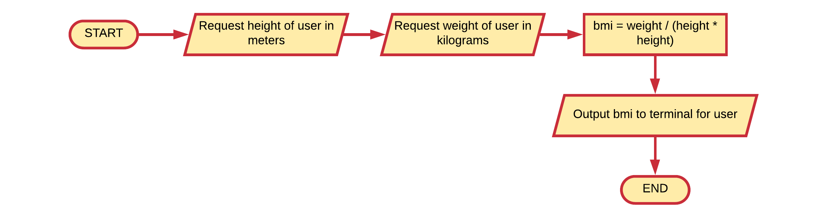

# Personalized BMI

Extend the BMI example (section on operators) to ask the user for his/her name and gender so a more personalized message can be outputted to the terminal.

What if the person did not like to provide his/her name. How would you handle that? Can you model it in the flowchart?

## Solution

<!-- Place your solution here. You can remove this comment -->
