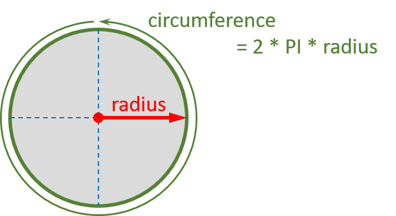
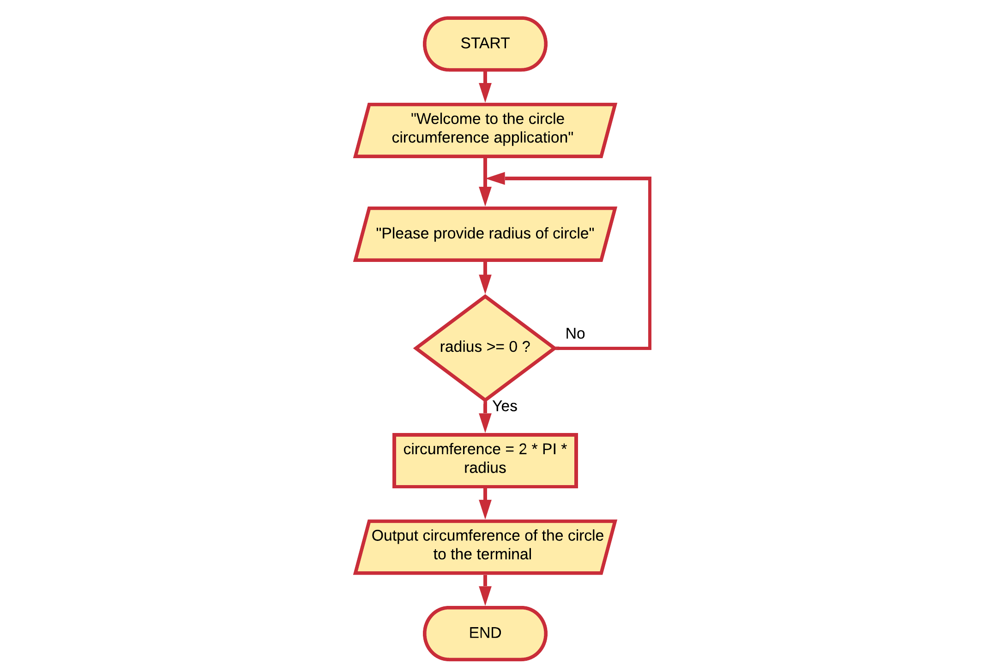

# Circle Circumference

Use a flowchart to model an application that calculates the `circumference` of a circle. Request the `radius` of the circle from the user and output the result back.

## Solution

While not strictly part of the instructions, it is a good idea to check user input. In this case checking if the radius is not negative is a good example.

