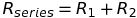
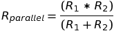
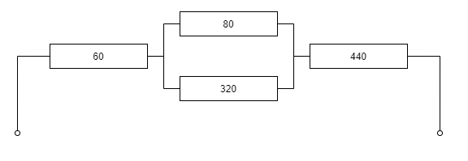
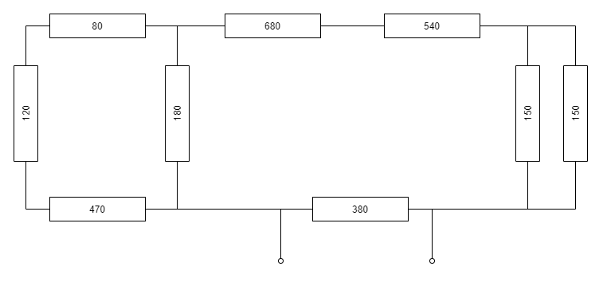

# La Resistance

Electronics / ICT students of VIVES often have to solve quitte complex resistor networks for their labs. A nice little app that would confirm their own calculation would be nice.

Well you are in luck. Meet "La Resistance". This app allows you to solve the most complex resistor networks. Do keep in mind that this little gem is still under development and you should help a little.

## Series Resistance

Calculating the equivalent resistor of two series resistors can be achieved using the formula below:



* Step 1: Create a method called `SolveSeries()` that takes two arguments of type `double`, each representing a resistor value. Implement the method so it returns the equivalent series value of the two resistor values.
* Step 2: Uncomment the first code block in `Main()` to test the method

Expected Output:

```text
The series equivalent of 120 and 200 is 320
```

## Parallel Resistance

Calculating the equivalent resistor of two parallel resistors can be achieved using the formula below:



* Step 3: Create a method called `SolveParallel()` that takes two arguments of type `double`, each representing a resistor value. Implement the method so it returns the equivalent parallel value of the two resistor values.
* Step 4: Uncomment the second code block in `Main()` to test the method.

Expected Output:

```text
The series equivalent of 120 and 200 is 320
The parallel equivalent of 120 and 200 is 75
```

## Solving a Basic Resistor Network



Solving the previous resistor network can be achieved using the following code snippet. Place it in `Main()` and check if the result is correct.

```csharp
double totalResistance = SolveParallel(80, 320);
totalResistance = SolveSeries(60, totalResistance);
totalResistance = SolveSeries(totalResistance, 440);

Console.WriteLine("The resulting equivalent resistance for the basic network is "
    + totalResistance);
```

Expected Output:

```text
The resulting equivalent resistance for the basic network is 564
```

## More Advanced Resistor Network

Now use all your skills to solve this more advanced network of resistors.



Output the result to the terminal.

```text
The resulting equivalent resistance for the advanced network is 300.523197461715
```
