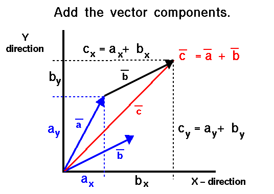

# Vector from Start to End

The idea of this app is to be able to model mathematical vectors in an xy-plane. Vectors can be chained one after another resulting in a total vector. This basically is a vector with an x-component equal to the sum of all the x-components of the vectors and a y-component equal to the sum of all the y-components of the vectors.



Create a new class called `Vector` that follows the following UML class diagram:

```text
#################################
# Vector
#################################
# - x: double
# - y: double
#################################
# + Vector()
# + Vector(x: double, y: double)
# + X(): double
# + Y(): double
# + Magnitude(): double
# + ToString(): string
#################################
```

The `Vector` class represents a mathematical vector rooted in the origin of the plane. It has a `head` at `[x,y]` and a magnitude (length).

Supply the following methods for the class:

* `Vector()`: The default constructor for a vector that initialized both the `x` and `y` part to `0`.
* `Vector(x: double, y: double)`: An initialization constructor that allows the user to create a vector with the given `x` and `y` coordinate.
* `X(): double`: Returns the x coordinate of the vector
* `Y(): double`: Returns the y coordinate of the vector
* `Magnitude(): double`: Return the magnitude/length of the vector
* `ToString(): string`: Return a string representation of the vector in the format `"[x;y] with magnitude ??"` (with `??` replacing its magnitude). Make sure to override the `Object.ToString()` method.

Next create a class `VectorPath` that follows the next UML diagram:

```text
#################################
# VectorPath
#################################
# - vectors: ArrayList<Vector>
#################################
# + Add(vector: Vector)
# + ResultingVector(): Vector
# + ToString(): string
#################################
```

This class allows us to hold a list of `Vector` objects inside of an [ArrayList](https://docs.microsoft.com/en-us/dotnet/api/system.collections.arraylist?view=netframework-4.8).

Adding vectors to an object of this class should be accomplished through the `Add()` method.

The total resulting vector can then be calculated using the `ResultingVector()` method.

The `ToString()` method of `VectorPath` should return a `string` with all the vector string representations chained with a newline in between them. If the list is empty return an empty string `""`.

Example:

```text
[11.3;4.1] with magnitude 12.0208152801713
[12.5;21.7] with magnitude 25.0427634257883
[-1;1] with magnitude 1.4142135623731
[2;-3] with magnitude 3.60555127546399
```

A small demo app is already supplied. Feel free to change this code.

Example:

```text
Welcome to Vectors - From Start to End
This app allows you to insert mathematical vectors
and calculate the resulting total vector.

Please enter the x and y coordinates (separated with space - both zero stops): 11.3 4.1
Please enter the x and y coordinates (separated with space - both zero stops): 12.5 21.7
Please enter the x and y coordinates (separated with space - both zero stops): -1 1
Please enter the x and y coordinates (separated with space - both zero stops): 2 -3
Please enter the x and y coordinates (separated with space - both zero stops): 0 0

-------------------------------------------------------
Summing all vector:
[11.3;4.1] with magnitude 12.0208152801713
[12.5;21.7] with magnitude 25.0427634257883
[-1;1] with magnitude 1.4142135623731
[2;-3] with magnitude 3.60555127546399

The resulting vector is: [24.8;23.8] with magnitude 34.3726635569605
-------------------------------------------------------

Thank you for using our app
```

## Unit Tests

This project has accompanying unit tests. See [xUnit Tests](/README.md#xunit-tests) on how to run them.

Do note that the unit tests will not run without errors until you created the class and the required methods. You could always put some of the tests in comments. Just make sure to uncomment them once the task at hand is supposedly finished.
