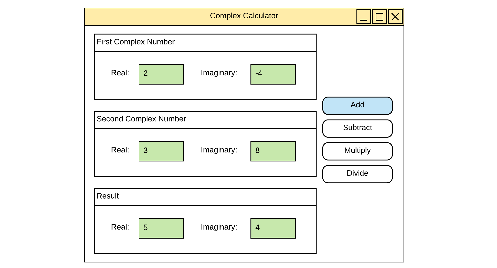

# Complex Calculator

Start from the challenge [Things are Complex](../23-defining-custom-classes/things_are_complex/README.md).

## Step 1 - Create a Solution and WPF app

Start by creating a new `WPF App (.NET Framework)`.

## Step 2 - Create a Library

Next create a new `.NET Standard Class Library` and copy the class `ComplexNumber` (from the challenge "Things are Complex") to this library. Include this library in your new WPF application by adding it as a *Reference*. Don't forget to include the namespace.

## Step 3 - Model the GUI

Create the graphical user interface. No need to add any code or behavior in the first steps.

You should be able to enter the `real` and `imaginary` part of the two complex numbers and display the result of the different operations:

* Add
* Subtract
* Multiply
* Divide

The next image shows a quick mockup of the UI. Make sure to give it your own touch. This example is just a sketch.

## Unit Tests

This project has no working unit tests at this moment.

## Remark

This challenge is an early draft. Still work in progress.
