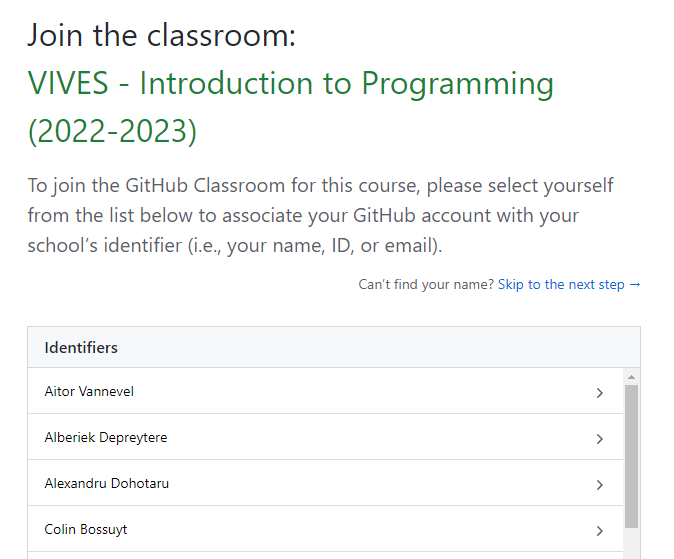
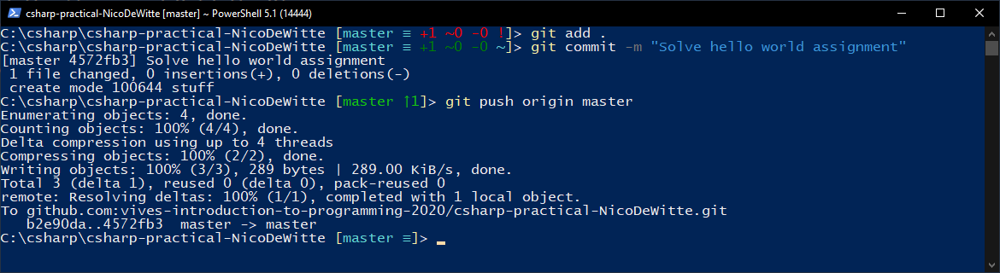

# CSharp Practical

This repository belongs to: **YOUR_NAME_HERE**

This repository contains the challenges that accompany the C\# course at VIVES University of Applied Sciences at Bruges which can be found at [http://base-to-ace.netlify.com](http://base-to-ace.netlify.com).

Each chapter contains a number of challenges. Some may come with solutions other may not. Most of them are accompanied by Unit Tests.

All challenges contain at least a `README.md` describing the task at hand. Most already contain a Visual Studio solution to start from.

## Starting as a Student

To get started you will first need to get a copy of this repository. Follow the steps below to get your own personal copy. This only needs to be done once.

1. Get the GitHub classroom invitation link from Toledo.
2. The first time you will need to allow GitHub Classroom access to your GitHub account. Click the `Authorize github` button.


3. Make sure to select your name from the roster. If your name is not present yet then you can click the `Skip to the next step` for now. But please inform your teacher in that case.



4. Now you can accept the assignment and wait for your own personal copy to be created (can take up to several minutes - please be patient)
5. Open the GitHub page of your repository
6. Copy the ssh clone-url (green button) that looks like `git@github.com:vives-intro-to-programming-2022-2023/csharp-practical-<username>.git`
7. Traverse to a local directory on your system where you wish to clone the repo using Windows Explorer. Open PowerShell in that location by holding down <kbd>Shift</kbd> and right clicking the directory. Next select `Open PowerShell window here` from the context menu.

    *Please don't choose a destination directory that is nested very deeply. The structure of this repo introduces quite a lot of subdirectories and might give problems towards maximum path length in Windows.*

    

8. Issue the `git clone` command followed by the url you copied (right click or <kbd>Ctrl</kbd> + <kbd>V</kbd> to paste).

```bash
git clone <place-ssh-url-here>
```

You should get a similar output:

```text
Cloning into 'csharp-practical-NicoDeWitte'...
Warning: Permanently added the RSA host key for IP address '140.82.121.4' to the list of known hosts.
remote: Enumerating objects: 1241, done.
remote: Counting objects: 100% (1241/1241), done.
remote: Compressing objects: 100% (625/625), done.
remote: Total 1241 (delta 546), reused 1241 (delta 546), pack-reused 0
Receiving objects: 100% (1241/1241), 602.71 KiB | 1.77 MiB/s, done.
Resolving deltas: 100% (546/546), done.
```

Now you should have your local copy of the repository.

All git commands in other sections should always be executed inside of the project dir called `csharp-practical-<username>`.

## Committing Changes

Changes can be committed and pushed back to GitHub using the terminal.

Traverse to your local `csharp-practical-<username>` directory and open a PowerShell window by holding down <kbd>Shift</kbd> and right clicking the directory. Next select `Open PowerShell window here` from the context menu, as done previously in [section Starting as a Student](#starting-as-a-student).

1. Add all changed files using the command: `git add .`
2. Commit the files and add a message: `git commit -m "My message goes here"`
3. Push your changes to GitHub: `git push origin master`

    

4. To make sure all is well, you can always issue the command `git status`, even in between other commands.

You can also navigate to your GitHub page of this repo and check if all went well.

Make it a habit of committing and pushing regularly. **At least after solving each assignment.**

Also checkout the [shortened version of these steps for everyday use](./short_instructions.md).

## Pulling the Latest Updates

To pull the latest updates you will first need to add the original repo on which this one was based. This only needs to be done once for every cloned instance:

```bash
git remote add base git@github.com:vives-intro-to-programming-2022-2023/csharp-practical.git
```

`base` is the name of remote repo. Now you should see two remotes when issuing the command `git remote -v`. For example:

```text
base     git@github.com:vives-intro-to-programming-2022-2023/csharp-practical.git (fetch)
base     git@github.com:vives-intro-to-programming-2022-2023/csharp-practical.git (push)
origin  git@github.com:vives-intro-to-programming-2022-2023/csharp-practical-NicoDeWitte.git (fetch)
origin  git@github.com:vives-intro-to-programming-2022-2023/csharp-practical-NicoDeWitte.git (push)
```

Now every time you wish to pull updates you need to follow these steps:

1. First make sure that you have no local changes. This can be seen by executing `git status`. It should state `nothing to commit, working tree clean`. If not, you first need to add and commit the changes (see section [Committing Changes](#committing-changes)).
2. Now issue the command `git pull base master --allow-unrelated-histories` to pull the latest changes.


Make sure you have no conflicts before committing everything.

Also checkout the [shortened version of these steps for everyday use](./short_instructions.md).

## Overview

Please indicate which challenges you have finished by placing a ✔️ emoji in the finished column. These were found at [https://emojipedia.org](https://emojipedia.org).

## xUnit Tests

Unit Tests allow code to be tested automatically for correctness.

Some challenges might be accompanied by these tests (👍 in `Unit Tests?` column).

Open the `Test Explorer` overview in Visual Studio by navigating to `Test => Windows => Test Explorer`.

Hit the first green arrow at the top left (Run All):


Normally the tests will always fail in the beginning.


If the challenge is solved correctly, all tests should pass.


### xUnit Framework not Found

If you get an error stating the the xUnit Framework cannot be found, you should check the NuGet package manager sources.

Traverse to `Tools => NuGet Package Manager => Package Manager Settings`. Next select the `Package Sources` entry as option (left side). It should contain the `nuget.org` package source as shown in the next screenshot:


If it does not exists, add it with the following settings:

* **Name:** `nuget.org`
* **Source:** `https://api.nuget.org/v3/index.json`

You may need to restart Visual Studio.

## Introduction to Programming

### Chapter 01 - Introduction to Computer Programming

| Finished | Challenge | Difficulty | Description |
| :---: | --- | --- | --- |
| ❌ | [Making a Sandwich](./01-introduction/ch_making_a_sandwich/README.md)                  | Easy | Document the process of making a ham and cheese sandwich. |
| ❌ | [Programming Languages](./01-introduction/ch_programming_languages/README.md)          | Medium | Search the Internet for some programming languages. |
| ❌ | [Processor Architecture](./01-introduction/ch_processor_architecture/README.md)        | Medium | Search the Internet for the meaning of a processor architecture. |
| ❌ | [Biggest Number in a List](./01-introduction/ch_biggest_number_in_a_list/README.md)    | Hard | Document the process of finding the biggest number in a list. |

### Chapter 02 - Basic Building Blocks

| Finished | Challenge | Difficulty | Description |
| :---: | --- | --- | --- |
| ❌ | [BMI Adult Check](./02-basic-building-blocks/ex_bmi_adult_check/README.md)               | Easy | Check if user is an adult when calculating the BMI |
| ❌ | [Personalized BMI](./02-basic-building-blocks/ch_personalized_bmi/README.md)             | Easy | Personalize the BMI example with the users name |
| ❌ | [Smartphones](./02-basic-building-blocks/ch_smartphones/README.md)                       | Easy | Determine the properties of Smartphones |
| ❌ | [Cinema](./02-basic-building-blocks/ex_cinema/README.md)                                 | Easy | Determine the properties of a cinema screening |
| ❌ | [Circle Circumference](./02-basic-building-blocks/ex_circle_circumference/README.md)     | Medium | Determine the circumference of a circle |
| ❌ | [Rectangle Area](./02-basic-building-blocks/ch_rectangle_area/README.md)                 | Medium | Determine the area of a rectangle |
| ❌ | [Motorcycles](./02-basic-building-blocks/ch_motorcycles/README.md)                       | Medium | Determine the properties of Motorcycles |
| ❌ | [Student Grader](./02-basic-building-blocks/ch_student_grader/README.md)                 | Medium | Output message to user based on his grade |
| ❌ | [Sum of Numbers](./02-basic-building-blocks/ch_sum_of_numbers/README.md)                 | Hard | Determine the sum of a list of numbers |

### Chapter 03 - Starting in C\#

| Finished | Challenge | Difficulty | Description | Unit Tests? |
| :---: | --- | --- | --- | :---: |
| ❌ | [Hello World](./03-starting-in-csharp/ch_hello_world/README.md)                    | Easy | Print a Hello World message | ❌ |
| ❌ | [Java Programmer](./03-starting-in-csharp/ch_java_programmer/README.md)            | Easy | Fix mistake of a Java programmer | ❌ |
| ❌ | [Basic Syntax Error](./03-starting-in-csharp/ch_basic_syntax_error/README.md)      | Easy | Find and fix a small syntax error | ❌ |
| ❌ | [Developed By](./03-starting-in-csharp/ch_developed_by/README.md)                  | Easy | Print message and your name | ❌ |
| ❌ | [My First App](./03-starting-in-csharp/ch_my_first_app/README.md)                  | Medium | Create a new VS Project | ❌ |
| ❌ | [Need a Break](./03-starting-in-csharp/ex_need_a_break/README.md)                  | Medium | Find and fix two small syntax errors | ❌ |
| ❌ | [Personal Details](./03-starting-in-csharp/ch_personal_details/README.md)          | Medium | Print out personal details | ❌ |

### Chapter 04 - Storing Data

| Finished | Challenge | Difficulty | Description | Unit Tests? |
| :---: | --- | --- | --- | :---: |
| ❌ | [C# Land](./04-storing-data/ex_csharp_land/README.md)                  | Easy | Initialize minimum required height variable | 👍 |
| ❌ | [Frame Delimiter](./04-storing-data/ex_frame_delimiter/README.md)      | Medium | Initialize start and end of frame delimiter | 👍 |
| ❌ | [Marco Polo](./04-storing-data/ex_marco_polo/README.md)                | Medium | Output some personal details about Marco Polo | 👍 |
| ❌ | [Programming Bugs](./04-storing-data/ex_programming_bugs/README.md)    | Hard | Output authored message of the day | 👍 |

### Chapter 05 - Processing Data

| Finished | Challenge | Difficulty | Description | Unit Tests? |
| :---: | --- | --- | --- | :---: |
| ❌ | [Rectangle Properties](./05-processing-data/ex_rectangle_properties/README.md)     | Easy | Calculate area and circumference of a rectangle | 👍 |
| ❌ | [Pythagoras](./05-processing-data/ex_pythagoras/README.md)                         | Easy | Implement the Pythagorean theorem | 👍 |
| ❌ | [Fundamental Calculus](./05-processing-data/ex_fundamental_calculus/README.md)     | Easy | Model a calculator | 👍 |
| ❌ | [Pizza Time](./05-processing-data/ex_pizza_time/README.md)                         | Medium | Divide pizzas among people | 👍 |
| ❌ | [Evaluation](./05-processing-data/ex_evaluation/README.md)                         | Medium | Determine final score of course | 👍 |
| ❌ | [Calculating VAT](./05-processing-data/ex_calculate_vat/README.md)                 | Medium | Calculate taxes on a net value | 👍 |
| ❌ | [Circle Properties](./05-processing-data/ch_circle_properties/README.md)           | Hard | Show properties of a circle | ❌ |

### Chapter 06 - Getting User Data

| Finished | Challenge | Difficulty | Description | Unit Tests? |
| :---: | --- | --- | --- | :---: |
| ❌ | [Student ID](./06-getting-user-data/student_id/README.md)        | Medium | Generate student email and ID | 👍 |
| ❌ | [Far From Home](./06-getting-user-data/far_from_home/README.md)  | Medium | Calculate fuel usage for a trip | ❌ |
| ❌ | [Time Machine](./06-getting-user-data/time_machine/README.md)    | Hard | Add hours and minutes to clock | 👍 |

### Chapter 07 - Methods

| Finished | Challenge | Difficulty | Description | Unit Tests? |
| :---: | --- | --- | --- | :---: |
| ❌ | [Hail C Sharp](./07-methods/hail_c_sharp/README.md)                                | Easy | Call a method that outputs statements | ❌ |
| ❌ | [Sum and Difference](./07-methods/sum_and_difference/README.md)                    | Easy | Call and create methods for Addition and Subtraction | ❌ |
| ❌ | [Hello Mister Roboto](./07-methods/hello_mister_roboto/README.md)                  | Easy | Create a method that outputs a greeting | ❌ |
| ❌ | [Toss a Die to Your Witcher](./07-methods/toss_a_die_to_your_witcher/README.md)    | Easy | Call die throwing method and store result | ❌ |
| ❌ | [La Resistance](./07-methods/la_resistance/README.md)                              | Medium | Solve resistor networks | ❌ |
| ❌ | [Its all About Timing](./07-methods/its_all_about_timing/README.md)                | Hard | Converts seconds to Timestamp | ❌ |

### Chapter 08 - Making Decisions

| Finished | Challenge | Difficulty | Description | Unit Tests? |
| :---: | --- | --- | --- | :---: |
| ❌ | [Rectangle Area](./08-making-decisions/rectangle_area/README.md)             | Easy | Determine area of rectangle | 👍 |
| ❌ | [Coordinate Plane](./08-making-decisions/coordinate_plane/README.md)         | Easy | Determine quadrant of a point in 2D space | 👍 |
| ❌ | [LED Series Resistor](./08-making-decisions/led_series_resistor/README.md)   | Easy | Determine the series resistor of an LED | 👍 |
| ❌ | [Baby Roulette](./08-making-decisions/baby_roulette/README.md)               | Medium | Build a guessing game | ❌ |
| ❌ | [Square Roots](./08-making-decisions/square_roots/README.md)                 | Medium | Determine square roots of integer numbers | ❌ |
| ❌ | [Drifting Years](./08-making-decisions/drifting_years/README.md)             | Medium | Check if given year is a leap year | 👍 |
| ❌ | [Biggest Number](./08-making-decisions/biggest_number/README.md)             | Medium | Biggest number out of 3 | 👍 |
| ❌ | [ConverterNator](./08-making-decisions/converternator/README.md)             | Hard | Menu Choice of Imperial versus Metric conversions | 👍 |
| ❌ | [Number Properties](./08-making-decisions/number_properties/README.md)       | Hard | Determine the properties of two numbers | ❌ |

### Chapter 09 - Loops

| Finished | Challenge | Difficulty | Description | Unit Tests? |
| :---: | --- | --- | --- | :---: |
| ❌ | [Up and Down](./09-loops/up_and_down/README.md)                          | Medium | Generate series using for-loops | ❌ |
| ❌ | [Roll Em All](./09-loops/roll_em_all/README.md)                          | Medium | Throwing Dice | ❌ |
| ❌ | [Start to End](./09-loops/start_to_end/README.md)                        | Medium | Summing Series | 👍 |
| ❌ | [Fibonacci Sequence](./09-loops/fibonacci_sequence/README.md)            | Medium | Generate the Fibonacci sequence | ❌ |
| ❌ | [Higher / Lower](./09-loops/higher_lower/README.md)                      | Medium | Build a higher /lower guessing game | ❌ |
| ❌ | [Greatest Common Factor](./09-loops/greatest_common_factor/README.md)    | Medium | Brute-force the gcf of two numbers | 👍 |
| ❌ | [AppleCake](./09-loops/apple_cake/README.md)                             | Medium | AppleCake word game | 👍 |
| ❌ | [Series of Squares](./09-loops/series_of_squares/README.md)              | Medium | Check for formula for a series of squares | 👍 |
| ❌ | [Number Manipulator](./09-loops/number_manipulator/README.md)            | Medium | Manipulate numbers digit by digit | 👍 |
| ❌ | [Child's Play](./09-loops/childs_play/README.md)                         | Hard | Summation Game | ❌ |
| ❌ | [Visual Rectangle](./09-loops/visual_rectangle/README.md)                | Hard | Drawing rectangle in the terminal | ❌ |

### Chapter 10 - Strings

| Finished | Challenge | Difficulty | Description | Unit Tests? |
| :---: | --- | --- | --- | :---: |
| ❌ | [Reversal](./10-strings/reversal/README.md)                        | Easy | Reverse the characters of a string | 👍 |
| ❌ | [Binary Coding](./10-strings/binary_coding/README.md)              | Easy | Convert binary to decimal | 👍 |
| ❌ | [Pattern Builder](./10-strings/pattern_builder/README.md)          | Easy | Shape builder app for console | ❌ |
| ❌ | [Text Properties](./10-strings/text_properties/README.md)          | Easy | Analyze string for character classes | 👍 |
| ❌ | [Holo Gram](./10-strings/holo_gram/README.md)                      | Easy | Check if sentence contains all the letters of the alphabet | 👍 |
| ❌ | [Parentheses Checker](./10-strings/parentheses_checker/README.md)  | Medium | Check line of code for matching parentheses | 👍 |
| ❌ | [Palindrome](./10-strings/palindrome/README.md)                    | Medium | Determine if a word is a palindrome | 👍 |
| ❌ | [Words Everywhere](./10-strings/words_everywhere/README.md)        | Medium | Determine the number of words in a text | 👍 |
| ❌ | [How Many Times](./10-strings/how_many_times/README.md)            | Medium | Find the number of occurrences of a word | 👍 |
| ❌ | [Abbreviate This](./10-strings/abbreviate_this/README.md)          | Medium | Abbreviate words in a string | 👍 |
| ❌ | [Not My Mail](./10-strings/not_my_mail/README.md)                  | Medium | Basic validation of email address | 👍 |
| ❌ | [Binary Nibble](./10-strings/binary_nibble/README.md)              | Hard | Binary representation of decimal value | 👍 |
| ❌ | [Replace Performance](./10-strings/replace_performance/README.md)  | Hard | Replace substring in text | 👍 |

### Chapter 11 - Arrays

| Finished | Challenge | Difficulty | Description | Unit Tests? |
| :---: | --- | --- | --- | :---: |
| ❌ | [Multiples of Three](./11-arrays/multiples_of_three/README.md)             | Easy | Generate array with multiples of three | 👍 |
| ❌ | [The Sum of All Numbers](./11-arrays/the_sum_of_all_numbers/README.md)     | Easy | Calculate sum of array of integers | 👍 |
| ❌ | [Absolute Sum](./11-arrays/absolute_sum/README.md)                         | Easy | Calculate sum of array of absolute values | 👍 |
| ❌ | [Parallel Arrays](./11-arrays/parallel_arrays/README.md)                   | Medium | Working with multiple arrays | 👍 |
| ❌ | [String to Numbers](./11-arrays/strings_to_numbers/README.md)              | Medium | Convert array of strings to array of integers | 👍 |
| ❌ | [Join the Resistance](./11-arrays/join_the_resistance/README.md)           | Medium | A resistor color band converter | ❌ |
| ❌ | [Turn the Tables](./11-arrays/turn_the_tables/README.md)                   | Medium | Multiply arrays with each other | 👍 |
| ❌ | [Biggest of them All](./11-arrays/biggest_of_them_all/README.md)           | Medium | Determine the biggest number in an array | 👍 |
| ❌ | [Time for Change](./11-arrays/time_for_change/README.md)                   | Hard | A vending machine simulator | ❌ |

### Chapter 23 - Creating and Using Objects

| Finished | Challenge | Difficulty | Description | Unit Tests? |
| :---: | --- | --- | --- | :---: |
| ❌ | [Point in Space](./23-creating-and-using-objects/point_in_space/README.md)     | Medium | Create class of 2D Point | 👍 |
| ❌ | [Round About](./23-creating-and-using-objects/round_about/README.md)           | Medium | Create a class for a Circle | 👍 |

### Chapter 24 - Defining Custom Classes

| Finished | Challenge | Difficulty | Description | Unit Tests? |
| :---: | --- | --- | --- | :---: |
| ❌ | [Teach the Teacher](./24-defining-custom-classes/teach_the_teacher/README.md)                    | Medium | Store personal details of teacher | 👍 |
| ❌ | [Kings of Nothing](./24-defining-custom-classes/kings_of_nothing/README.md)                      | Medium | Implement a player class for a game | 👍 |
| ❌ | [The Paint Factory](./24-defining-custom-classes/the_paint_factory/README.md)                    | Medium | Calculate how much paint is required for complex surfaces | 👍 |

### Chapter 25 - Getters, Setters and Properties

| Finished | Challenge | Difficulty | Description | Unit Tests? |
| :---: | --- | --- | --- | :---: |
| ❌ | [Super String Theory](./25-getters-setters-properties/super_string_theory/README.md)             | Medium | Add properties and implement string methods | 👍 |
| ❌ | [Third Rock from the Sun](./25-getters-setters-properties/third_rock_from_the_sun/README.md)     | Hard | Calculate properties of the Earth (sphere) | 👍 |

### Chapter 26 - Constructors

| Finished | Challenge | Difficulty | Description | Unit Tests? |
| :---: | --- | --- | --- | :---: |
| ❌ | [I Can Hear Colors](./26-constructors/i_can_hear_colors/README.md)                               | Easy | Refactor the Color class with properties and constructors | 👍 |
| ❌ | [Back to the Future](./26-constructors/back_to_the_future/README.md)                             | Medium | Create a TimeStamp class | 👍 |
| ❌ | [Vector from Start to End](./24-defining-custom-classes/vector_from_start_to_end/README.md)      | Medium | Create vectors and calculate resulting total vector | 👍 |
| ❌ | [Quadratic](./24-defining-custom-classes/quadratic/README.md)                                    | Medium | Solve a quadratic equation | ❌ |
| ❌ | [Things are Complex](./24-defining-custom-classes/things_are_complex/README.md)                  | Hard | Math with Complex numbers | 👍 |


### Chapter 28 - Interfaces

| Finished | Challenge | Difficulty | Description | Unit Tests? |
| :---: | --- | --- | --- | :---: |
| ❌ | [Generator of Numbers](./28-interfaces/generator-of-numbers/README.md)         | Medium | Create an interface for number generators | ❌ |
| ❌ | [Total Surface](./28-interfaces/total-surface/README.md)                       | Medium | Fix tightly coupled classes | ❌ |

### Chapter 50 - Introduction to WPF

| Finished | Challenge | Difficulty | Description | Unit Tests? |
| :---: | --- | --- | --- | :---: |
| ❌ | [Count Me Up Scotty](./50-introduction-to-wpf/count-me-up-scotty/README.md)        | Medium | Create a WPF App for Count Me Up Scotty | ❌ |
| ❌ | [Complex Calculator](./50-introduction-to-wpf/complex-calculator/README.md)        | Medium | Create a WPF App for Things Are Complex | ❌ |
| ❌ | [Hangman Refactored](./50-introduction-to-wpf/hangman-refactored/README.md)        | Medium | Refactor the hangman game to a library and create a GUI | ❌ |
