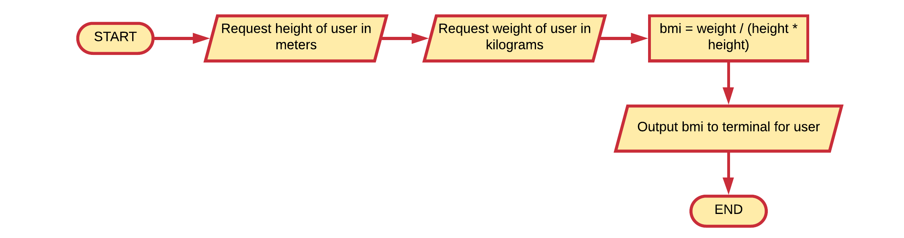
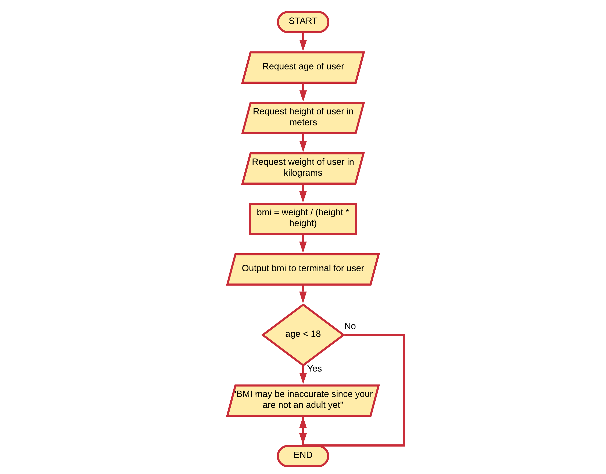

# BMI Adult Check

Extend the BMI example (section on operators) to ask the user for his/her age. If the persons age is below 18, output a message that the calculated BMI is not accurate as the person is not an adult.

## Solution

