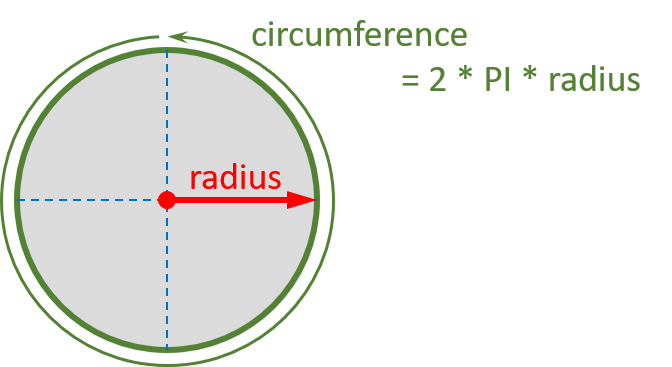

# Circle Circumference

Use a flowchart to model an application that calculates the `circumference` of a circle. Request the `radius` of the circle from the user and output the result back.

## Solution

The solution can be found [here](./solution.md)
